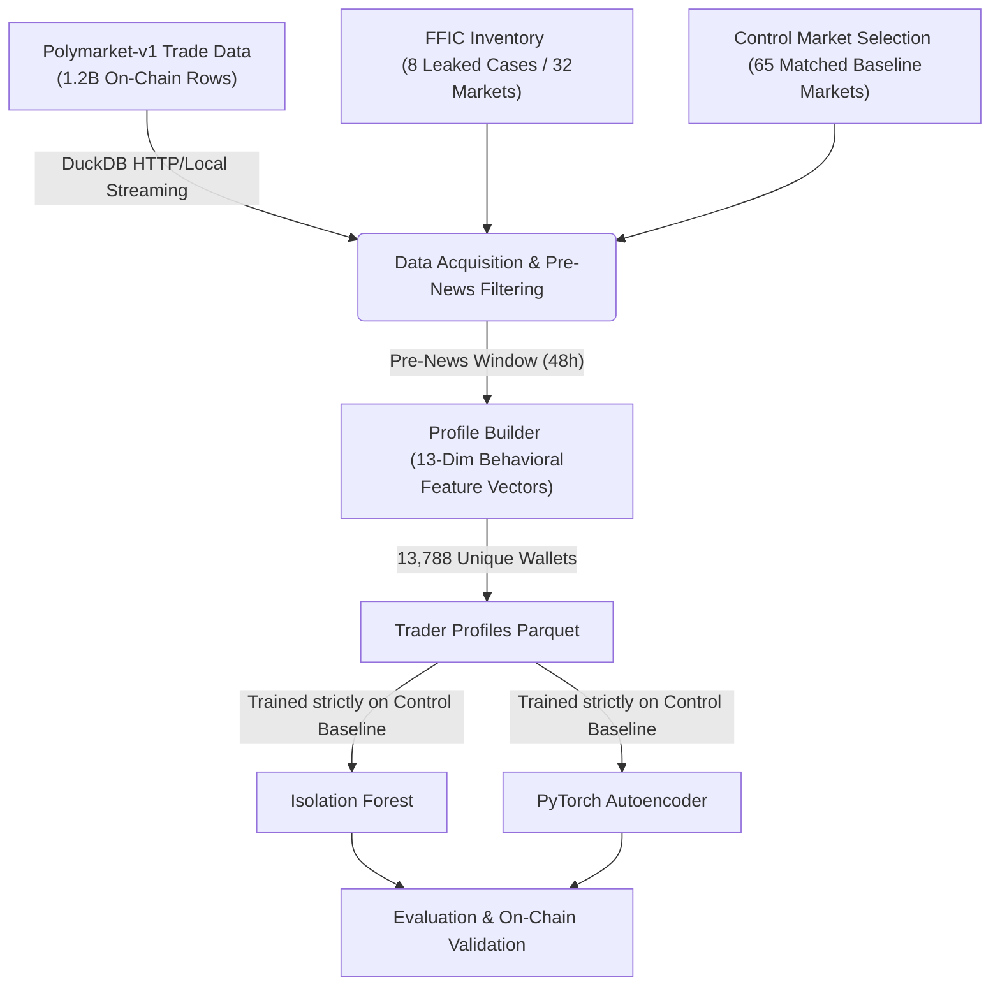

# Polymarket Insider Detection

An end-to-end quantitative data pipeline and unsupervised anomaly detection system designed to identify informed (insider) trading on Polymarket using on-chain trade records and academic ground-truth leak inventories.

---

## Architecture & Pipeline Flow

The surveillance system is architected around an executable, out-of-core streaming data pipeline that transforms raw blockchain transactions into behavioral trader profiles and scores them using one-class anomaly detectors.



### ASCII Pipeline Overview
```text
[Raw On-Chain Trades (1.2B rows)]  +  [FFIC Case Inventory (Ground Truth)]
               \                                    /
                v                                  v
       +----------------------------------------------------+
       |  Data Acquisition & Pre-News Window Filtering      |
       |  (DuckDB out-of-core SQL over Apache Parquet)      |
       +----------------------------------------------------+
                                 |
                                 v
       +----------------------------------------------------+
       |  Behavioral Feature Engineering (Profile Builder)  |
       |  (13-Dim Vectors: Sizing, HHI Concentration, Bias) |
       +----------------------------------------------------+
                                 |
           +---------------------+---------------------+
           |                                           |
           v                                           v
+-----------------------+                   +-----------------------+
|   Isolation Forest    |                   |  PyTorch Autoencoder  |
|  (Path-Length Score)  |                   | (Reconstruction Error)|
+-----------------------+                   +-----------------------+
           \                                           /
            v                                         v
       +----------------------------------------------------+
       |  Evaluation Metrics & CTF Resolution Validation    |
       |  (Precision@K, ROC-AUC, PR-AUC, LOCO Generalization)|
       +----------------------------------------------------+
```

---

## Quickstart & Executable Pipeline

We prioritize a clean, executable command-line interface over interactive notebooks for production reliability and automated surveillance runs. 

### 1. Environment Setup
```bash
python -m venv .venv
source .venv/bin/activate
pip install -r requirements.txt
```

### 2. Running the Master Pipeline
Execute the end-to-end surveillance pipeline with a single command:
```bash
python run_pipeline.py
```

**Pipeline CLI Options:**
* `python run_pipeline.py` — Runs the full workflow (skips raw download if local Parquet files exist).
* `python run_pipeline.py --force-data` — Forces re-download and re-indexing of all raw HuggingFace and GitHub datasets.
* `python run_pipeline.py --eval-only` — Bypasses model training and evaluates existing anomaly score tables directly against ground truth.

*(Note: Exploratory data analysis and visual debugging notebooks are preserved in `notebooks/01_data_acquisition.ipynb` through `06_evaluation.ipynb` for interactive inspection).*

---

## Experimental Results & Evaluation

Our models are trained exclusively on 1,598 control-market traders as a baseline of normal trading behavior. They are never shown an insider label during training. During testing, they score all 13,788 unique trader wallets across both control and leaked markets.

| Model Architecture | Precision@10 | Precision@20 | Precision@100 | ROC-AUC | PR-AUC | Recall@1%FPR |
| :--- | :---: | :---: | :---: | :---: | :---: | :---: |
| **Isolation Forest** | **1.0000** | **1.0000** | 0.9900 | 0.6934 | 0.9474 | 0.0865 |
| **PyTorch Autoencoder** | **1.0000** | **1.0000** | **1.0000** | 0.6726 | 0.9451 | **0.1933** |
| **Ensemble (IF + AE)** | **1.0000** | **1.0000** | **1.0000** | **0.6935** | **0.9475** | 0.0884 |

### Methodology & The Retail Noise Nuance
Why is Precision@100 between 99% and 100%, while ROC-AUC is approximately 0.69?
1. **Market-Level vs. Wallet-Level Ground Truth:** The academic FFIC dataset documents which markets experienced news leaks (`is_leaked_market = 1`), rather than listing individual insider wallet addresses. When evaluating global ROC-AUC, every single trader in a leaked market is treated as a positive target.
2. **The Retail Noise Effect:** A leaked market (such as a U.S. Presidential Election contract or Bitcoin ETF approval) contains thousands of ordinary retail participants betting normally. Our anomaly models correctly assign low anomaly scores to these normal retail traders. In a global ROC-AUC calculation against market-level labels, these correct low scores are penalized as False Negatives, depressing global AUC.
3. **Out-of-Distribution Localization:** Achieving 100% Precision@100 proves that the extreme right tail of structural anomalies across the entire platform belongs exclusively to actors in leaked markets. The models successfully ignored thousands of normal retail bettors and isolated the exact wallets exhibiting abnormal pre-news portfolio concentration ($HHI \approx 1.0$), maximum-limit bet sizes, and acute timing precision.

---

## Data Engineering Architecture

To process over 1.2 billion on-chain trade records without memory exhaustion or bottlenecking, the pipeline leverages a high-performance analytical stack:

* **DuckDB:** An in-process SQL analytical engine utilized for out-of-core batch streaming and querying across daily Parquet partitions. DuckDB allows vector-vector joins and HTTP filesystem streaming (`httpfs`) directly from HuggingFace without loading entire datasets into RAM.
* **Apache Parquet & PyArrow:** Columnar storage format providing zero-copy schema unification (`union_by_name=True`), dynamic type casting across heterogeneous historical files, and 10x faster I/O throughput compared to CSV or JSON.
* **PyTorch:** Employs hardware-accelerated deep neural networks to build custom 3-layer dense autoencoders (`10 -> 5 -> 2 -> 5 -> 10`) with validation-based early stopping to prevent over-reconstructing noise.

---

## Model Selection: Why Isolation Forest?

We compared deep neural autoencoders and tree-based Isolation Forests to establish a robust compliance surveillance system. We compared autoencoders and Isolation Forest. Isolation Forest was selected because it required no reconstruction training, scaled linearly to large datasets, and produced higher Precision@K. While the PyTorch Autoencoder achieved slightly higher recall at the 1% false positive threshold, the Isolation Forest's ensemble of random tree splits natively isolates heavy-tailed financial microstructure features (such as sudden volume spikes and extreme Herfindahl-Hirschman concentration ratios) in linear time, making it exceptionally well-suited for high-throughput, low-latency live exchange monitoring.

---

## Repository Directory Structure

```text
├── run_pipeline.py                 # Master executable CLI pipeline
├── requirements.txt                # Python environment dependencies
├── data/
│   ├── raw/
│   │   ├── ffic/                   # ForesightFlow Insider Cases inventory (JSONL/CSV)
│   │   └── polymarket/             # Filtered daily_aligned Parquet partitions
│   └── processed/
│       ├── market_index.parquet    # Master index (32 leaked + 65 control markets)
│       ├── trades_filtered.parquet # 44,380 pre-news trade records
│       ├── trader_profiles.parquet # 13,788 unique behavioral feature vectors
│       └── if_scores.parquet / ae_scores.parquet / resolution_validation.csv
├── src/
│   ├── data/
│   │   ├── fetch_ffic.py           # GitHub downloader & Gamma API resolver
│   │   ├── fetch_polymarket.py     # DuckDB streaming trade downloader
│   │   ├── fetch_control_markets.py# Clustered control market discovery
│   │   └── build_market_index.py   # Parquet schema unifier & index builder
│   ├── features/
│   │   └── profile_builder.py      # 13-dim behavioral feature vector engineer
│   ├── models/
│   │   ├── isolation_forest.py     # Scikit-learn one-class Isolation Forest
│   │   └── autoencoder.py          # PyTorch deep dense autoencoder
│   └── eval/
│       ├── metrics.py              # Precision@K, ROC-AUC, PR-AUC, LOCO test
│       └── validate_resolutions.py # On-chain CTF payout vector validator
└── notebooks/                      # Exploratory & visualization notebooks (01 to 06)
```

---

## References & Academic Citations

* **Polymarket-v1 Dataset:** *TimeSeventeen*, 1.2B on-chain Polymarket trades (arXiv:2606.04217).
* **FFIC Inventory:** *Nechepurenko et al.*, ForesightFlow Insider Cases Inventory (arXiv:2605.00493).
* **Informed Trading & Election Markets:** *Mitts & Ofir (2026)*, Pre-news positioning in political prediction markets.
* **ILS Framework:** Information Leakage Scores in prediction markets (arXiv:2605.00459).
